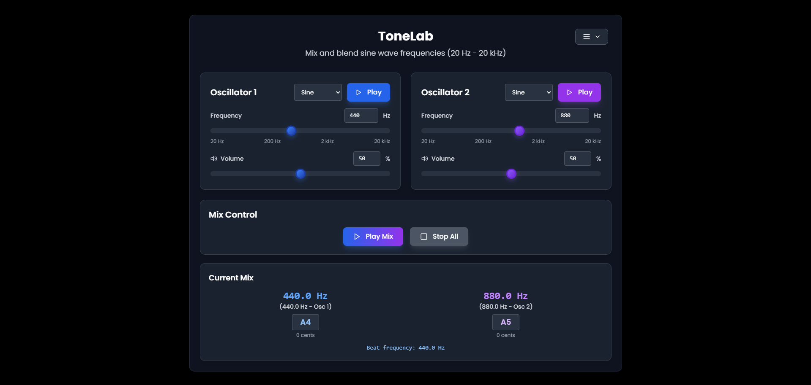
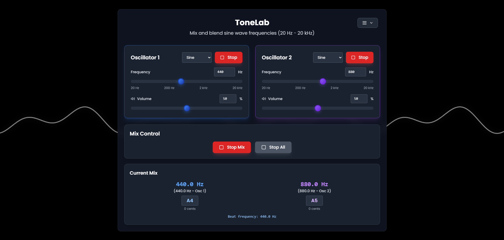
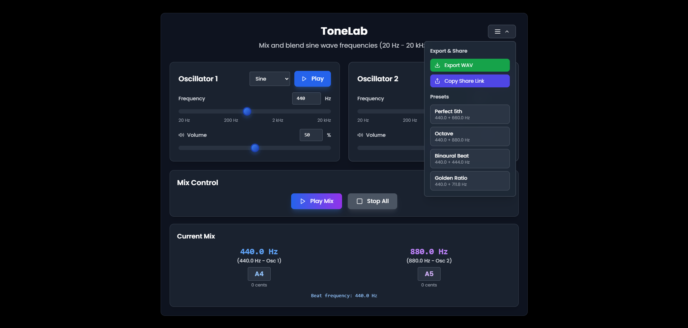

# 🎵 ToneLab
*Professional web-based audio frequency generator and mixer*

[Live Demo](https://tone-lab-beta.vercel.app/)
## Overview
A modern, professional tone mixer for generating and blending sine wave frequencies. Built with React and Web Audio API, featuring logarithmic frequency scaling, musical note detection, and real-time audio export capabilities.

Perfect for:
- Audio engineers and sound designers
- Musicians exploring intervals and tuning
- Binaural beat generation
- Equipment testing and calibration
- Educational audio demonstrations

## ✨ Features

### Core Audio Engine
- **Full spectrum coverage**: 20 Hz - 20 kHz (complete human hearing range)
- **Multiple waveforms**: Sine, Square, Triangle, Sawtooth
- **Real-time mixing**: Dual oscillator architecture with independent controls
- **Musical intelligence**: Automatic note detection with cent deviation
- **Beat frequency calculation**: Live monitoring of interference patterns

### Advanced Controls
- **Logarithmic frequency scaling**: Precise control across the entire spectrum
- **Individual volume control**: Independent amplitude adjustment per oscillator
- **Preset intervals**: Perfect 5th, Octave, Binaural Beat, Golden Ratio
- **URL sharing**: Share exact configurations via link
- **WAV export**: Generate 10-second audio files for offline use

### User Experience
- **Keyboard shortcuts**: Space (Play Mix), Escape (Stop All)
- **Responsive design**: Works seamlessly on desktop and mobile
- **Real-time visual feedback**: Color-coded channels and live waveform display
- **Professional UI**: Clean, modern interface inspired by studio equipment

## 🛠 Technical Stack
- **Frontend**: React 18, TypeScript
- **Audio**: Tone.js, Web Audio API
- **Styling**: Tailwind CSS
- **Fonts**: Poppins (UI), Monospace (technical displays)
- **Icons**: Lucide React

## 🚀 Quick Start

### Prerequisites
- Node.js 16+ 
- npm or yarn

### Installation
```bash
# Clone the repository
git clone https://github.com/lukefr09/ToneLab.git
cd ToneLab

# Install dependencies
npm install

# Start development server
npm run dev

# Build for production
npm run build
```

### Development
```bash
# Start development server with hot reload
npm run dev

# Run linting
npm run lint

# Preview production build
npm run preview
```

## ⌨️ Keyboard Shortcuts
- `Space` - Play/Stop Mix
- `Escape` - Stop All Oscillators

## 🎼 Audio Engineering Concepts

This project demonstrates several key audio engineering principles:

### Logarithmic Frequency Perception
Human hearing perceives frequency logarithmically, so our sliders use log scaling for natural control. The frequency range from 20 Hz to 20 kHz is mapped logarithmically, providing intuitive control across the entire audible spectrum.

### Beat Frequencies
When two frequencies mix, they create amplitude modulation at the difference frequency. The app calculates and displays this beat frequency in real-time, showing the interference pattern between oscillators.

### Musical Intervals
Mathematical ratios between frequencies create consonant/dissonant sounds. Built-in presets demonstrate common musical intervals:
- **Perfect 5th**: 3:2 ratio (440 Hz + 660 Hz)
- **Octave**: 2:1 ratio (440 Hz + 880 Hz)
- **Binaural Beat**: 4 Hz difference for brainwave entrainment
- **Golden Ratio**: φ (1.618) ratio for unique harmonic relationships

### Psychoacoustics
The 20 Hz - 20 kHz range covers the limits of human hearing, with logarithmic scaling matching our natural frequency perception.

## 🎛️ Advanced Features

### Real-time Waveform Visualization
- Full-screen canvas animation showing live waveforms
- Color-coded channels (blue for Osc 1, purple for Osc 2)
- Combined waveform display when both oscillators are active
- Dynamic opacity based on volume levels

### Musical Note Integration
- Automatic note detection with cent deviation display
- Direct note input (e.g., "A4", "C#5")
- Real-time tuning feedback
- Support for sharps and flats

### Export & Sharing
- **WAV Export**: Generate 10-second audio files with custom naming
- **URL Sharing**: Share exact configurations via encoded URLs
- **Preset System**: Quick access to common musical intervals

### Professional Audio Features
- **Offline Audio Context**: High-quality WAV generation
- **Sample Rate**: 44.1 kHz professional audio quality
- **Bit Depth**: 16-bit audio output
- **Stereo Output**: Dual-channel audio processing

## 📱 Screenshots

### Main Interface

*Dual oscillator interface with logarithmic frequency controls and real-time visualization*


*ToneLab working with visualizer in background*

### Presets Menu & Export Options

*Quick access to musical intervals and special configurations*

## 🔧 Technical Implementation

### Audio Architecture
```typescript
// Dual oscillator setup with independent controls
const osc1 = new Tone.Oscillator(freq1, waveform1);
const osc2 = new Tone.Oscillator(freq2, waveform2);
const gain1 = new Tone.Gain(volume1);
const gain2 = new Tone.Gain(volume2);
```

### Logarithmic Scaling
```typescript
// Convert frequency to slider position (logarithmic)
const freqToSliderValue = (freq: number): number => {
  return Math.log(freq / MIN_FREQ) / Math.log(MAX_FREQ / MIN_FREQ);
};

// Convert slider position to frequency (logarithmic)
const sliderValueToFreq = (sliderValue: number): number => {
  return MIN_FREQ * Math.pow(MAX_FREQ / MIN_FREQ, sliderValue);
};
```

### Musical Note Detection
```typescript
// Convert frequency to nearest musical note
const frequencyToNote = (frequency: number): string => {
  const A4 = 440;
  const semitones = Math.round(12 * Math.log2(frequency / A4));
  const octave = Math.floor((semitones + 9) / 12) + 4;
  const noteIndex = ((semitones + 9) % 12 + 12) % 12;
  return `${noteNames[noteIndex]}${octave}`;
};
```

## 🎯 Use Cases

### Audio Engineering
- **Equipment Testing**: Generate precise test tones for speaker/headphone calibration
- **Frequency Analysis**: Explore harmonic relationships and interference patterns
- **Sound Design**: Create custom tones for synthesis and effects

### Music Production
- **Tuning Reference**: Use as a digital tuning fork for instruments
- **Interval Training**: Practice recognizing musical intervals
- **Harmonic Exploration**: Discover new harmonic combinations

### Scientific Applications
- **Psychoacoustic Research**: Study frequency perception and masking
- **Binaural Beat Research**: Generate specific brainwave entrainment frequencies
- **Audio Education**: Demonstrate fundamental audio concepts

### Accessibility
- **Hearing Tests**: Generate tones for basic hearing assessment
- **Tinnitus Relief**: Create masking frequencies for tinnitus sufferers
- **Audio Therapy**: Generate therapeutic frequencies for relaxation

### Development Setup
1. Fork the repository
2. Create a feature branch (`git checkout -b feature/amazing-feature`)
3. Commit your changes (`git commit -m 'Add amazing feature'`)
4. Push to the branch (`git push origin feature/amazing-feature`)
5. Open a Pull Request

## 📄 License

This project is licensed under the MIT License - see the [LICENSE](LICENSE) file for details.

## 🙏 Acknowledgments

- **Tone.js**: Web Audio framework for the browser
- **Lucide React**: Beautiful, customizable icons
- **Tailwind CSS**: Utility-first CSS framework
- **Web Audio API**: Native browser audio capabilities

## 📞 Support

- **Issues**: [GitHub Issues](https://github.com/lukefr09/ToneLab/issues)
- **Discussions**: [GitHub Discussions](https://github.com/lukefr09/ToneLab/discussions)
- **GitHub**: [@lukefr09](https://github.com/lukefr09)

---

*Built with ❤️ for the audio community*

*ToneLab - Where science meets sound* 
